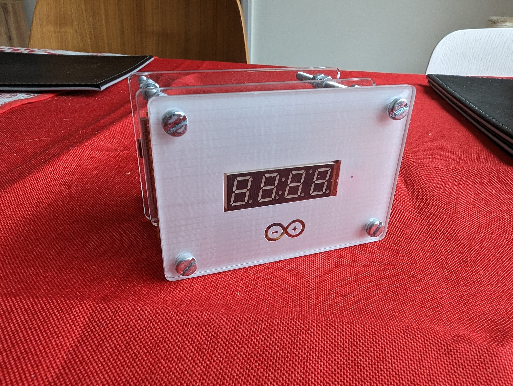
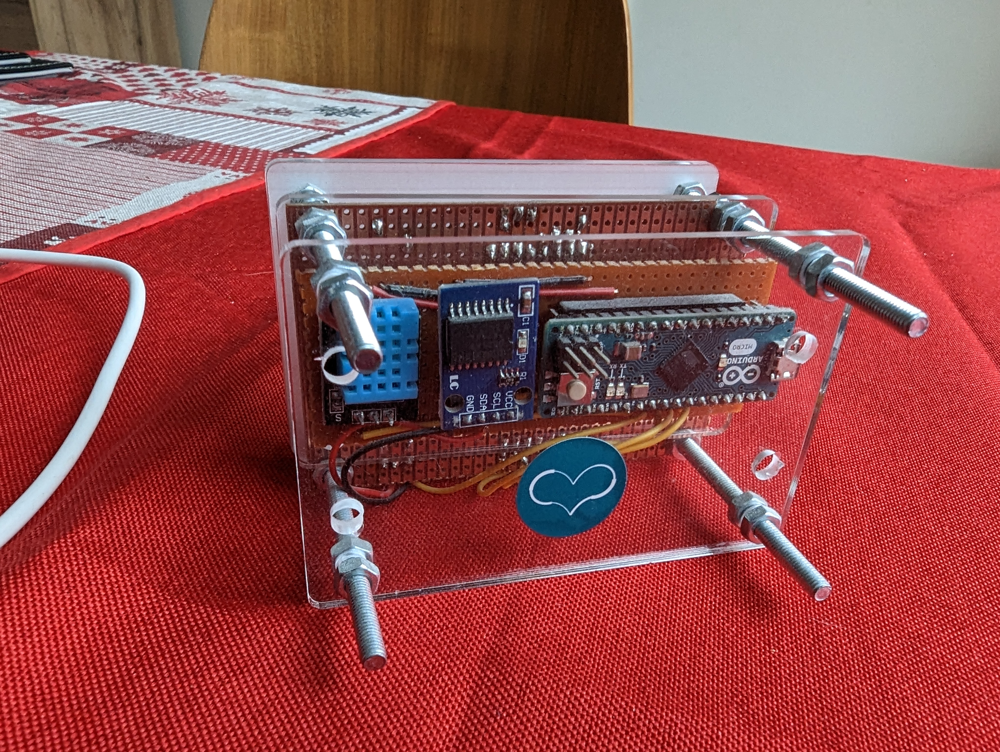
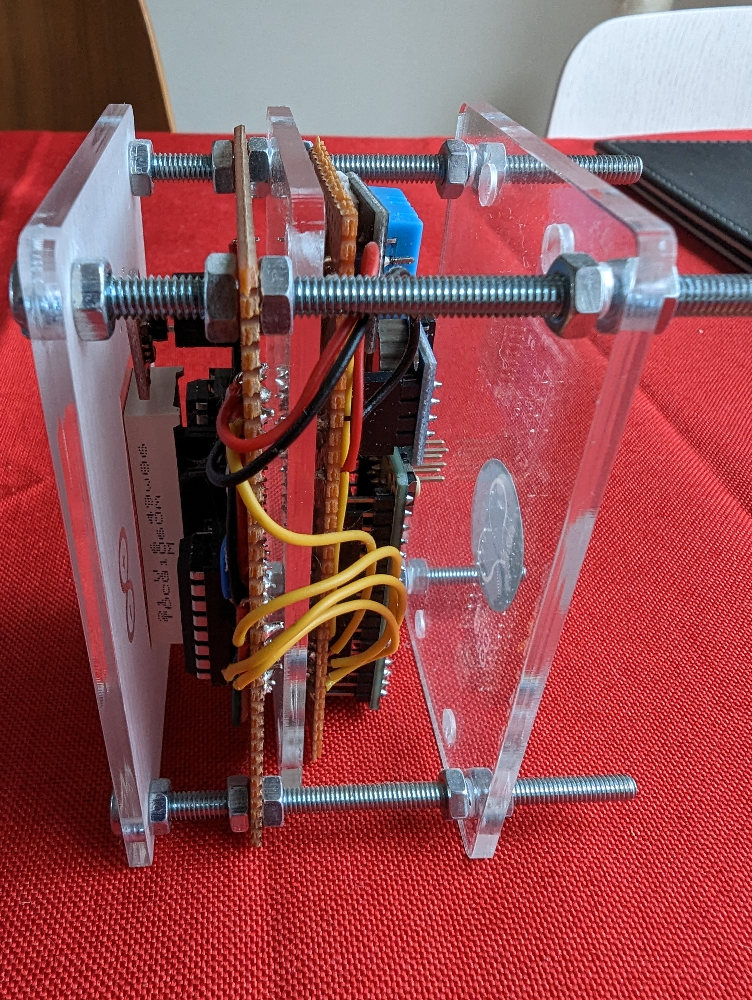
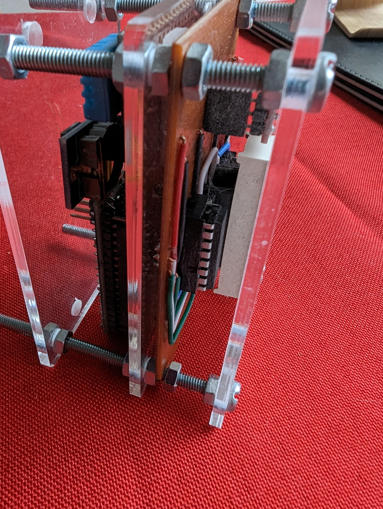

# **Arduino Desk Clock**

This is my first *real life* Arduino project, a digital desk clock with thermometer built in 2017.
It is using an Arduino Micro board, a DHT11 temperature sensor, a 4 digit 7-segment display, two 74HC595 shift registers and a capacitive touch sensor used to switch between displaying the time or the temperature.

The case was designed using [Inkscape](https://inkscape.org/) and made by [Ponoko](https://www.ponoko.com/) laser cutting and engraving company.

  

Unfortunately the device is no longer functioning, after a couple of years of continuous usage and even longer just sitting in a drawer. It's just a project I couldn't leave out.

 
 
 
